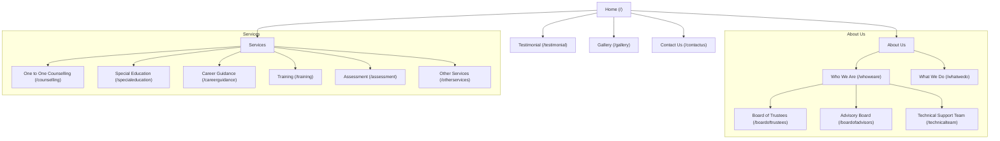

# Application Flow

This diagram represents the navigation structure of the Raj Mind Health Services website (v2 Upgrade).

```mermaid
graph TD
    Home["Home (/)"] --> About["About Us"]
    Home --> Services["Services"]
    Home --> Testimonial["Testimonial (/testimonial)"]
    Home --> Gallery["Gallery (/gallery)"]
    Home --> Contact["Contact Us (/contactus)"]

    subgraph AboutGroup ["About Us"]
        About --> WhoWeAre["Who We Are (/whoweare)"]
        WhoWeAre --> Trustees["Board of Trustees (/boardoftrustees)"]
        WhoWeAre --> Advisors["Advisory Board (/boardofadvisors)"]
        WhoWeAre --> Technical["Technical Support Team (/technicalteam)"]
        About --> WhatWeDo["What We Do (/whatwedo)"]
    end

    subgraph ServicesGroup ["Services"]
        Services --> Counselling["One to One Counselling (/counselling)"]
        Services --> SpecialEd["Special Education (/specialeducation)"]
        Services --> Career["Career Guidance (/careerguidance)"]
        Services --> Training["Training (/training)"]
        Services --> Assessment["Assessment (/assessment)"]
        Services --> Other["Other Services (/otherservices)"]
    end
```
